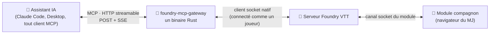

<div align="center">

# 🎲 foundry-mcp-gateway

**Donnez une place à votre assistant IA autour de la table.**

Un serveur [MCP](https://modelcontextprotocol.io) indépendant pour [Foundry VTT](https://foundryvtt.com) —
un petit binaire Rust qui se connecte à votre monde *comme un joueur* et offre à votre IA
**134 outils** pour préparer, animer et mettre en scène vos parties.

[](https://www.rust-lang.org)
[](https://foundryvtt.com)
[](https://modelcontextprotocol.io)
[](LICENSE)

**🇬🇧 [English version](README.md)** · [Démarrage rapide](#-démarrage-rapide) · [Que peut-il faire ?](#-ce-que-votre-ia-peut-faire-à-votre-table) · [Comment c'est fait](#%EF%B8%8F-comment-cest-fait) · [Contribuer](#-contribuer)

</div>

---

## ✨ Pourquoi ?

Vous passez des heures à préparer vos séances : journaux, PNJ, scènes, compendiums.
Votre assistant IA connaît déjà votre campagne — ce serveur lui permet d'**agir** dessus :

> *« Résume ce que le groupe a appris sur Toydaria, puis prépare trois rumeurs pour
> la scène du marché — en articles de journal dans le dossier Acte VI. »*
>
> *« Lance Perception pour Pahas'Tis, en caché. »*
>
> *« Fais pleuvoir sur cette scène, assombris l'ambiance, et joue un sting quand la
> porte s'ouvre. »*

Aucun module requis dans Foundry pour commencer. Aucun navigateur à garder ouvert.
Il tourne 24h/24 contre votre monde, depuis n'importe quelle machine.

## 🚀 Démarrage rapide

**Avant de commencer**, il vous faut :

- un monde Foundry **joignable depuis internet en HTTPS** (hébergeur, ou votre
  serveur avec un domaine — un Foundry qui ne vit que sur `localhost` est
  inatteignable pour une passerelle hébergée) ;
- un accès Gamemaster ;
- une dizaine de minutes.

**1 · Créez un utilisateur bot dans Foundry** — en MJ : *Configurer les joueurs →
Créer un utilisateur*, ex. `MCP-Bot`, rôle **Gamemaster**, avec mot de passe.
(Un rôle inférieur fonctionne — Foundry refuse proprement ce qui dépasse ses
droits — mais écritures, combats et outils de séance échouent alors : la
panoplie complète exige Gamemaster.)
Puis récupérez son `_id` (16 caractères) — sans terminal :

> Ouvrez `view-source:https://VOTRE-HOTE/join` dans votre navigateur (collez-le
> dans la barre d'adresse), <kbd>Ctrl/Cmd+F</kbd>, cherchez `MCP-Bot` — le
> `"_id"` juste à côté du nom est ce qu'il vous faut, ex. `AbCdEfGh12345678`.

<details>
<summary>À l'aise au terminal ? Une ligne.</summary>

```sh
curl -s https://VOTRE-HOTE/join | grep -o '{"name":"MCP-Bot"[^}]*'
```
</details>

**2 · Configurez et lancez le serveur.** Trois voies — **choisissez-en une**.
Pas de Rust sur votre machine ? ☁️ Clever Cloud ou 🐳 Docker ci-dessous
construisent tout pour vous. Deux réglages comptent partout : `MCP_SECRET`
(long et aléatoire — c'est lui qui protège votre monde) et
`FOUNDRY_CREDENTIALS_JSON` (qui est le bot, où).

Avec Rust installé, en local :

```sh
export MCP_SECRET="une-longue-chaine-aleatoire"    # votre endpoint : /mcp-<secret>
export FOUNDRY_CREDENTIALS_JSON='[{
  "_id": "mon-monde",
  "hostname": "mon-hote.com/mon-monde",            # préfixe de route supporté
  "userid": "AbCdEfGh12345678",
  "password": "le-mdp-du-bot"
}]'
export FOUNDRY_ADMIN_PASSWORD="…"                  # optionnel : débloque les admin_*

cargo run --release                                 # binaire : target/release/foundry-mcp
```

<details>
<summary>☁️ Déployer sur Clever Cloud (5 commandes)</summary>

```sh
clever create --type rust foundry-mcp-gateway
clever env set MCP_SECRET "une-longue-chaine-aleatoire"
clever env set FOUNDRY_CREDENTIALS_JSON '[{"_id":"…","hostname":"…","userid":"…","password":"…"}]'
clever env set CC_RUST_BIN foundry-mcp
clever deploy
```
</details>

<details>
<summary>🐳 Lancer avec Docker</summary>

```sh
docker build -t foundry-mcp-gateway .
docker run -d --name foundry-mcp -p 8080:8080 \
  -e MCP_SECRET="une-longue-chaine-aleatoire" \
  -e FOUNDRY_CREDENTIALS_JSON='[{"_id":"…","hostname":"…","userid":"…","password":"…"}]' \
  foundry-mcp-gateway
```

Ou en compose :

```yaml
services:
  foundry-mcp:
    build: .
    ports: ["8080:8080"]
    environment:
      MCP_SECRET: "une-longue-chaine-aleatoire"
      FOUNDRY_CREDENTIALS_JSON: '[{"_id":"…","hostname":"…","userid":"…","password":"…"}]'
      # FOUNDRY_ADMIN_PASSWORD: "…"
    restart: unless-stopped
```

L'image embarque un healthcheck `/health`. Mettez du HTTPS devant (reverse
proxy) avant de l'exposer sur internet — le secret voyage dans l'URL.
</details>

**3 · Branchez votre IA :**

```sh
claude mcp add foundry --transport http https://VOTRE-DEPLOIEMENT/mcp-<secret>
```

Claude Desktop : *Réglages → Connecteurs → Connecteur personnalisé*, même URL.
Puis demandez simplement : *« ping mon Foundry »* — un `connected: true` et c'est
gagné. Plusieurs mondes ? Plusieurs objets dans le tableau, bascule via
`choose_foundry_instance`.

**4 · (Recommandé) installez le module compagnon** — voir [plus bas](#-le-module-compagnon).

### 🆘 Si quelque chose coince

| Symptôme | Cause probable → remède |
|---|---|
| `/health` ne répond pas | Le serveur ne tourne pas / mauvaise URL — voir les logs du déploiement |
| `ping` dit non connecté | Le monde n'est pas **lancé** (la page de connexion doit être visible), ou mauvais `userid`/`password` — le serveur réessaie en boucle, corrigez et patientez quelques secondes |
| Tous les `client_*` expirent | Compagnon absent/désactivé, **ou aucun navigateur MJ connecté**, ou l'onglet MJ dort (les navigateurs gèlent les onglets d'arrière-plan — remettez-le au premier plan) |
| Des outils ont disparu après une mise à jour | Votre client MCP met la liste en cache — reconnectez-le (Claude Code : `/mcp`) |
| Pas d'outils `admin_*` | `FOUNDRY_ADMIN_PASSWORD` n'est pas défini côté serveur |

## 🧙 Ce que votre IA peut faire à votre table

131 outils, organisés comme travaille un MJ. Les outils en lecture seule sont
annotés (auto-approbables par votre client MCP) ; seules les suppressions sont
marquées destructives.

### 📖 Préparer — construire et interroger votre monde

| Outils | Pour quoi |
|---|---|
| `get_actors` `get_items` `get_journals` `get_scenes` `get_tables` `get_macros` `get_playlists` `get_cards` `get_combats` `get_messages` `get_folders` `get_users` `get_settings` (+ formes singulières) | Lire **toutes** les collections — filtres à chemins pointés et opérateurs (`__in`, `__contains`, `__ne`, `__exists`), projection, pagination. ~7 000 journaux listés en ~0,3 s |
| `search_journals` · `export_journals` | Recherche plein texte · export Markdown de tout votre lore |
| `create_document` `modify_document` `delete_document` | Tout écrire : journaux, acteurs, scènes… docs imbriqués via `parent_uuid`, compendiums via `pack` |
| `list_compendium_packs` `get_pack_documents` `import_from_compendium` `create_compendium` `delete_compendium` | Le cycle compendium complet |
| `browse_files` `create_directory` `upload_file` | Fichiers — uploadez cartes et illustrations par URL ou base64 |
| `get_world` `ping` `get_setting` `set_setting` `show_credentials` `choose_foundry_instance` | Métadonnées, santé, réglages, multi-mondes |

### 🎬 Animer — la télécommande du MJ

| Outils | Pour quoi |
|---|---|
| `show_journal_to_players` · `share_image` | « Regardez tous ça » — handouts, révélations |
| `activate_scene` `get_current_scene` `pull_users_to_scene` | Changer de scène, y entraîner le groupe |
| `list_tokens` `place_token` `move_token` `update_token` | Les tokens de la scène vivante |
| `toggle_actor_condition` (27 statuts) · `apply_critical_injury` | Conditions et critiques |
| `manage_combat` (création / initiative / tours / fin) · `get_combat` | Tout le cycle du combat |
| `control_playlist` · `draw_from_table` | Musique · tirages sur vos tables d100 |
| `toggle_pause` · `wait_for_message` · `get_events` | Pause · attendre la réponse chat d'un joueur · flux d'événements en direct |
| `list_actor_ownership` `set_actor_ownership` · `grant_xp` | Permissions et récompenses |

### 👁️ Percevoir — l'IA *voit* votre table *(compagnon)*

| Outil | Pour quoi |
|---|---|
| 📸 `client_capture` | Capture de la vue MJ, renvoyée en vraie image — l'IA voit littéralement la carte |
| 🗺️ `client_scene_report` | La scène lisible par machine : tokens en cases, disposition, visibilité **réelle**, portes, lumières, gabarits |
| 📊 `client_get_derived` | Les valeurs **préparées** d'une fiche (post-`prepareData` + effets actifs) — la source stocke souvent 0 là où le joueur voit la vraie stat |
| 🔗 `client_enrich` | HTML enrichi : liens `@UUID` résolus, jets inline évalués, secrets MJ |
| 🔎 `client_search` | Recherche par nom sur toutes les collections via l'index client |
| 🌍 `client_babele` | Traductions [Babele](https://foundryvtt.com/packages/babele) : recherche inverse par nom **affiché** (retrouver « Force Lightning » depuis « Éclair de Force »), index et documents traduits |

### 🗣️ Interagir — un dialogue avec vos joueurs *(compagnon)*

| Outil | Pour quoi |
|---|---|
| ❓ `client_ask` | Poser une question dans un vrai dialogue **sur l'écran d'un joueur** et récupérer sa réponse |
| 🎲 `client_roll_formula` | **Toute formule, tout système** via le vrai moteur `Roll` de Foundry — carte de chat native, Dice So Nice, données de l'acteur, détail dé par dé |
| 📣 `client_notify` · 🔔 `client_ping` · 🎥 `client_pan_camera` | Notifications, pings de carte, mouvements de caméra « regardez ici » — tous ciblables (`gm` / `players` / ids) |
| 📜 `client_show_document` | Ouvrir une fiche chez les clients ciblés |
| 🎯 `client_select` / `client_target` · 🌫️ `client_fog` | Sélection et cibles réelles · réinitialiser le brouillard exploré |
| 📡 `client_get_state` · `client_status` | Qui est connecté, qui regarde quoi · santé du compagnon et dépendances détectées |
| 🚀 `client_run_macro` · `client_run_script` | Toute macro (le passe-partout) · JS arbitraire (**désactivé par défaut**, opt-in MJ) |

### 🌦️ Ambiance — la mise en scène *(compagnon)*

| Outil | Pour quoi |
|---|---|
| 🌧️ `client_weather` / `client_weather_types` | Particules [FXMaster](https://foundryvtt.com/packages/fxmaster) : pluie, brouillard, braises, neige, chauves-souris… |
| ✨ `client_play_effect` · `client_seq_between` · `client_seq_sound` | Effets [Sequencer](https://foundryvtt.com/packages/sequencer) sur un point, **entre deux tokens** (projectiles !), sons |
| 🎇 `client_token_fx` / `client_token_fx_presets` | [Token Magic FX](https://foundryvtt.com/packages/tokenmagic) : lueur, feu, ombre… 70 préréglages |
| 🗂️ `client_effect_catalog` | Chercher dans la base d'effets installée (JB2A & co) un chemin valide |
| 🔊 `client_play_sound` | Un sting sonore ponctuel, sans playlist |
| 🎞️ `mat_list` · `client_mat_trigger` | [Monk's Active Tiles](https://foundryvtt.com/packages/monks-active-tiles) : lister et déclencher les tuiles-actions |

### 🎲 Dés et systèmes de jeu

La logique spécifique vit dans des modules enfichables ([ajoutez le vôtre !](#-contribuer)) :

| Système | Outils |
|---|---|
| **Star Wars FFG** | `roll_actor_skill` (pool **dérivé de la fiche** : espèce, talents, équipement), `roll_ffg_pool`, `request_player_roll` (bouton de chat qui ouvre le dialogue du joueur), `adjust_actor_stats`, `adjust_destiny`, `grant_xp`, `apply_critical_injury` · compagnon : `client_roll_pool_native` (**vrai moteur FFG + dés 3D Dice So Nice**) |
| **D&D 5e** | `dnd5e_roll_check` (modificateurs dérivés de la fiche, avantage, DD, 20/1 naturels), `dnd5e_adjust_stats` |
| **Daggerheart** | `dh_roll_duality` (2d12 Espoir/Peur), `dh_roll_actor_trait`, `dh_adjust_stats` |

Tous chargés par défaut ; restreignez avec `FOUNDRY_SYSTEMS=starwarsffg,dnd5e`.

### 🗃️ Gestion de campagne — la suite [wgtnGM](https://campaigncodex.wgtngm.com/)

| Addon | Outils |
|---|---|
| **[Campaign Codex](https://foundryvtt.com/packages/campaign-codex)** | `cc_list_sheets` `cc_get_sheet` `cc_create_sheet` `cc_link` · compagnon : `client_cc_convert` (migration journal→fiche en masse), `client_cc_export_obsidian`, `client_cc_open_toc` |
| **Asset Librarian** | `al_tag` / `al_find` · compagnon : `client_al_open` |
| **Mini Calendar** | `mc_get_time` / `mc_set_time` / `mc_list_notes` · compagnon : `client_mc_set_time` (aube/crépuscule), `client_mc_open` |

### 🛠️ Administration — le monde lui-même

`manage_modules` et `admin_edit_world` marchent toujours. Le reste n'apparaît que
si `FOUNDRY_ADMIN_PASSWORD` est défini.

| Outil | Pour quoi |
|---|---|
| 🩺 `admin_status` | `/api/status` — marche même monde éteint |
| ✏️ `admin_edit_world` | Titre, description, image de fond, prochaine session — monde allumé |
| 🧩 `manage_modules` | Installés vs activés (avec versions) · activer/désactiver |
| 👥 `manage_users` | Comptes joueur / MJ / assistant MJ : lister, créer, changer les rôles, assigner un personnage (les mots de passe restent dans Foundry) |
| 💾 `admin_list_backups` / `admin_backup_world` | Les sauvegardes natives de Foundry — et `admin_update_package` en prend une automatiquement avant |
| ⏻ `admin_shutdown_world` / `admin_launch_world` | Éteindre et lancer des mondes (le bot se reconnecte seul) |
| ⬆️ `admin_check_package` / `admin_update_package` | Mettre à jour modules, **systèmes**, mondes — check → install → vérification, refuse si un monde tourne |


### 🌍 Plusieurs mondes à la fois

Mettez plusieurs objets dans `FOUNDRY_CREDENTIALS_JSON` et la passerelle les sert
**simultanément** — une socket par instance, ouverte à la demande :

- chaque outil accepte un `instance` optionnel (l'`_id` de `show_credentials`) ;
- `choose_foundry_instance` ne fait que déplacer le *défaut* — les autres restent connectées ;
- **`copy_documents`** transfère du contenu entre deux instances : sélection par
  `where`/`ids`, `_id` conservés (les liens `@UUID` survivent), dossiers recréés,
  `dry_run` pour prévisualiser, `overwrite` pour mettre à jour les jumeaux de la
  cible au lieu de les dupliquer.

```jsonc
// « je prépare dans mon monde bac à sable, puis j'envoie vers le monde de jeu »
copy_documents { from: "bac-a-sable", to: "jeu", collection: "journals",
                 where: { "folder": "aBcD…" }, dry_run: true }
```

Deux serveurs différents ? Les documents seuls laisseraient des chemins d'images
dans le vide : complétez avec **`copy_assets`**, qui parcourt le stockage source,
recrée l'arborescence sur la cible et téléverse ce qui manque (en transitant par la
passerelle — les deux serveurs n'ont jamais besoin de se joindre). Les deux outils
sont incrémentaux : les relancer ne déplace que ce qui a changé.


### 🚚 Migrer un monde vers un autre serveur

Toute la chaîne est couverte — chaque étape avec `dry_run` d'abord :

| Étape | Outil |
|---|---|
| 1. Mettre la cible à parité | `manage_modules` (l'état des lieux) → `admin_install_package` (système + modules) |
| 2. Créer le monde de destination | `admin_create_world` |
| 3. Y verser le contenu | `copy_documents`, collection par collection : dossiers → journaux/objets/tables → acteurs → scènes |
| 4. Emmener les fichiers | `copy_assets` (sinon les images pendent dans le vide) |
| 5. Recréer les joueurs | `manage_users` (noms, rôles, personnages — **les mots de passe restent au MJ**) |

Les `_id` sont conservés de bout en bout : les liens `@UUID` et les références
scène→acteur survivent au déménagement.

### 🧠 Au-delà des outils — le MCP natif

- **Resources** — acteurs et journaux navigables avec pagination par curseur
- **Prompts** — `session-recap`, `world-overview`, `prep-checklist`, pré-remplis en direct
- **Subscriptions** — `resources/updated` poussé quand un document souscrit change
- **Notifications SSE** — chaque broadcast Foundry relayé sur le flux

Vous intégrez programmatiquement (sans IA) ? **[docs/integrators.md](docs/integrators.md)**
documente la forme exacte des réponses — enveloppe, lectures, événements, compagnon, admin.

## 🧩 Le module compagnon

Le protocole socket n'atteint que des *documents*. Tout ce qui est marqué
*(compagnon)* ci-dessus demande
**[foundry-mcp-gateway-companion](https://github.com/wanoo/foundry-mcp-gateway-companion)** —
un petit module Foundry dans le navigateur du MJ, qui exécute ce que le serveur lui
délègue : 35 handlers derrière les outils `client_*`.

- Optionnel : sans lui, les `client_*` expirent avec un message clair ; tout le reste marche.
- Installation : *Modules → Installer → URL du manifest* :
  `https://github.com/wanoo/foundry-mcp-gateway-companion/releases/latest/download/module.json`
- Sûr par défaut : `client_run_script` (JS arbitraire) est **désactivé** tant que le MJ ne l'active pas.
- Dégradation propre : chaque intégration ne s'active que si son module est présent
  (Dice So Nice, Sequencer, FXMaster, Token Magic, Campaign Codex, Babele…).

## 🏗️ Comment c'est fait



- **Ni SDK ni wrapper** — la spec MCP (2025-03-26) et le protocole Engine.IO/Socket.IO
  de Foundry sont implémentés directement : handshake, ping-pong, corrélation des
  acks, buffer de broadcasts.
- **v13 et v14** — le binding de session (query vs cookie) est auto-détecté via
  `/api/status` ; préfixes de route (`hote.com/mon-monde`) supportés.
- **Rapide** — lectures par collection avec pushdown des requêtes côté serveur et
  listings sur index BDD ; jamais de dump complet (hors `get_world`).
- **Auto-réparant** — reconnexion infinie à backoff ; survit aux redémarrages du
  monde et même à une migration v13→v14 en vol.
- **Mode lecture seule** — `FOUNDRY_READONLY=1` n'expose que les 50 outils de lecture
  et refuse les écritures : brancherez-y des intégrations joueurs ou non fiables.
- **MCP 2025-06-18** — avec négociation 2025-03-26 et sortie structurée.
- **Protocole compagnon** — trois modes de livraison : *scène* (tous les clients
  ciblés exécutent), *adressé* (le client ciblé répond — `client_ask`), *unique*
  (un seul MJ répondeur élu).
- **Chaque intégration est vérifiée contre un monde réel** avant d'être livrée —
  les chemins de données changent entre versions, et deviner, c'est mentir.

## 🤝 Contribuer

Le cœur est 100 % agnostique — tout le spécifique jeu ou addon est un plugin.
**[CONTRIBUTING.md](CONTRIBUTING.md)** détaille les deux points d'extension :

- **🎮 Un système de jeu** (`src/systems/<id>.rs`) : trois fonctions
  (`definitions`, `handles`, `run`), moteurs de dés à RNG injectable pour des tests
  déterministes. `swffg.rs` est la référence — y compris un moteur de dérivation de fiches.
- **🧩 Une intégration d'addon** : outil serveur (`src/tools/`) + handler compagnon
  (`scripts/addons/*.mjs`) qui parlent un petit protocole de commandes.

Règle d'or dans les deux cas : **vérifiez vos chemins de données sur un monde réel**
et dites quelle version vous avez validée. `cargo test` doit rester vert.

## 📋 Changelog

Versioned with semver — response shapes only change on a major bump.
See [CHANGELOG.md](CHANGELOG.md).

## 📜 Licence

[MIT](LICENSE). Sans affiliation avec Foundry Gaming LLC.
