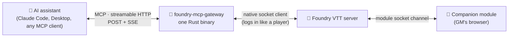

<div align="center">

# 🎲 foundry-mcp-gateway

**Give your AI assistant a seat at your gaming table.**

An independent [MCP](https://modelcontextprotocol.io) server for [Foundry VTT](https://foundryvtt.com) —
one small Rust binary that logs into your world *like a player* and hands your AI **126 tools**
to prep, run, and stage your games.

[](https://www.rust-lang.org)
[](https://foundryvtt.com)
[](https://modelcontextprotocol.io)
[](LICENSE)

**🇫🇷 [Version française](README.fr.md)** · [Quick start](#-quick-start) · [What can it do?](#-what-your-ai-can-do-at-your-table) · [How it works](#%EF%B8%8F-how-it-works) · [Contributing](#-contributing)

</div>

---

## ✨ Why?

You spend hours preparing sessions: writing journals, statting NPCs, building scenes,
digging through compendia. Your AI assistant already knows your campaign — this server
lets it **act** on it:

> *“Summarize what the party learned on Toydaria, then prep three rumors for the
> market scene — as journal entries in the Act VI folder.”*
>
> *“Roll Perception for Pahas'Tis, hidden.”*
>
> *“Make it rain on this scene, dim the mood, and play a sting when the door opens.”*

No module required in Foundry to get started. No browser to keep open. It runs 24/7
against your world, from any machine — or free-tier cloud hosting.

## 🚀 Quick start

**1 · Create a bot user in Foundry** — as GM: *Configure Players → Create Additional
User*, e.g. `MCP-Bot`, role **Gamemaster**, with a password. Grab its 16-char `_id`:

```sh
curl -s https://YOUR-HOST/join | grep -o '{"name":"MCP-Bot"[^}]*'
# → ..."_id":"AbCdEfGh12345678"...
```

**2 · Configure & run the server** (anywhere with HTTPS in front):

```sh
export MCP_SECRET="a-long-random-string"          # your endpoint: /mcp-<secret>
export FOUNDRY_CREDENTIALS_JSON='[{
  "_id": "my-world",
  "hostname": "my-host.com/my-world",             # route prefix supported
  "userid": "AbCdEfGh12345678",
  "password": "the-bot-password"
}]'
export FOUNDRY_ADMIN_PASSWORD="…"                 # optional: unlocks admin_* tools

cargo run --release                                # binary: target/release/foundry-mcp
```

<details>
<summary>☁️ Deploy on Clever Cloud (5 commands)</summary>

```sh
clever create --type rust foundry-mcp-gateway
clever env set MCP_SECRET "a-long-random-string"
clever env set FOUNDRY_CREDENTIALS_JSON '[{"_id":"…","hostname":"…","userid":"…","password":"…"}]'
clever env set CC_RUST_BIN foundry-mcp
clever deploy
```
</details>

**3 · Connect your AI:**

```sh
claude mcp add foundry --transport http https://YOUR-DEPLOYMENT/mcp-<secret>
```

Claude Desktop: *Settings → Connectors → Add custom connector*, same URL.
Health check: `curl https://YOUR-DEPLOYMENT/health` → `ok`. Several worlds? Put several
objects in the credentials array and switch with `choose_foundry_instance`.

**4 · (Recommended) install the companion module** — see [below](#-the-companion-module).

## 🧙 What your AI can do at your table

126 tools, organized the way a GM works. Read-only tools are flagged so your MCP
client can auto-approve them; only deletions are marked destructive.

### 📖 Prep — build and query your world

| Tools | What for |
|---|---|
| `get_actors` `get_items` `get_journals` `get_scenes` `get_tables` `get_macros` `get_playlists` `get_cards` `get_combats` `get_messages` `get_folders` `get_users` `get_settings` (+ singular forms) | Read **any** collection — filters with dotted paths & operators (`__in`, `__contains`, `__ne`, `__exists`), field projection, pagination. ~7,000 journals listed in ~0.3 s |
| `search_journals` · `export_journals` | Full-text search · Markdown export of your whole lore |
| `create_document` `modify_document` `delete_document` | Write anything: journals, actors, scenes… embedded docs via `parent_uuid`, compendia via `pack` |
| `list_compendium_packs` `get_pack_documents` `import_from_compendium` `create_compendium` `delete_compendium` | Full compendium workflow |
| `browse_files` `create_directory` `upload_file` | File storage — upload maps & art by URL or base64 |
| `get_world` `ping` `get_setting` `set_setting` `show_credentials` `choose_foundry_instance` | World metadata, health, settings, multi-world |

### 🎬 Run the session — the GM's remote control

| Tools | What for |
|---|---|
| `show_journal_to_players` · `share_image` | “Everyone, look at this” — handouts, art reveals |
| `activate_scene` `get_current_scene` `pull_users_to_scene` | Scene changes, drag the party along |
| `list_tokens` `place_token` `move_token` `update_token` | Token control on the live scene |
| `toggle_actor_condition` (27 core statuses) · `apply_critical_injury` | Conditions & crits |
| `manage_combat` (create / initiative / turns / end) · `get_combat` | Full combat lifecycle |
| `control_playlist` · `draw_from_table` | Music control · roll on your d100 tables |
| `toggle_pause` · `wait_for_message` · `get_events` | Pause · wait for a player's chat reply · live event feed (writes, chat, combat) |
| `list_actor_ownership` `set_actor_ownership` · `grant_xp` | Permissions & rewards |

### 👁️ Perception — the AI *sees* your table *(companion)*

| Tool | What for |
|---|---|
| 📸 `client_capture` | Screenshot of the GM's view, returned as a real image — the AI literally sees the map |
| 🗺️ `client_scene_report` | Machine-readable scene: tokens with grid coords, disposition, **real** visibility, doors, lights, templates |
| 📊 `client_get_derived` | The **prepared** values of any sheet (post-`prepareData` + active effects) — source docs often store 0 where players see the real stat |
| 🔗 `client_enrich` | Enriched HTML: `@UUID` links resolved, inline rolls evaluated, GM secrets |
| 🔎 `client_search` | Name search across every collection via the client index |
| 🌍 `client_babele` | [Babele](https://foundryvtt.com/packages/babele) translations: reverse search by **displayed** name (find “Force Lightning” from “Éclair de Force”), translated indexes & documents |

### 🗣️ Interact — a dialogue with your players *(companion)*

| Tool | What for |
|---|---|
| ❓ `client_ask` | Pose a question in a real dialog **on a player's screen** and get their answer back |
| 📣 `client_notify` · 🔔 `client_ping` · 🎥 `client_pan_camera` | Notifications, map pings, “everyone look here” camera moves — all targetable (`gm` / `players` / user ids) |
| 📜 `client_show_document` | Open a sheet on the targeted clients |
| 🎯 `client_select` / `client_target` · 🌫️ `client_fog` | Real selection & crosshair targets · reset explored fog |
| 📡 `client_get_state` · `client_status` | Who's connected, viewing what · companion health & detected deps |
| 🚀 `client_run_macro` · `client_run_script` | Run any macro (the universal key) · arbitrary JS (**off by default**, GM opt-in) |

### 🌦️ Atmosphere — stagecraft *(companion)*

| Tool | What for |
|---|---|
| 🌧️ `client_weather` / `client_weather_types` | [FXMaster](https://foundryvtt.com/packages/fxmaster) particles: rain, fog, embers, snow, bats… |
| ✨ `client_play_effect` · `client_seq_between` · `client_seq_sound` | [Sequencer](https://foundryvtt.com/packages/sequencer) effects at a point, **between tokens** (projectiles!), sounds |
| 🎇 `client_token_fx` / `client_token_fx_presets` | [Token Magic FX](https://foundryvtt.com/packages/tokenmagic): glow, fire, shadow… 70 presets |
| 🗂️ `client_effect_catalog` | Search the installed effect database (JB2A & co) for valid paths |
| 🔊 `client_play_sound` | One-shot sound sting, no playlist needed |
| 🎞️ `mat_list` · `client_mat_trigger` | [Monk's Active Tiles](https://foundryvtt.com/packages/monks-active-tiles): list & fire trigger tiles (teleports, scene changes, chains) |

### 🎲 Dice & game systems

Game-specific logic lives in pluggable modules ([add yours!](#-contributing)):

| System | Tools |
|---|---|
| **Star Wars FFG** | `roll_actor_skill` (pool **derived from the sheet**: species, talents, gear), `roll_ffg_pool`, `request_player_roll` (chat button opens their roll dialog), `adjust_actor_stats`, `adjust_destiny`, `grant_xp`, `apply_critical_injury` · companion: `client_roll_pool_native` (**real FFG engine + Dice So Nice 3D dice**) |
| **D&D 5e** | `dnd5e_roll_check` (sheet-derived modifiers, advantage, DC, nat 20/1), `dnd5e_adjust_stats` |
| **Daggerheart** | `dh_roll_duality` (Hope/Fear 2d12), `dh_roll_actor_trait`, `dh_adjust_stats` |

All modules load by default; restrict with `FOUNDRY_SYSTEMS=starwarsffg,dnd5e`.

### 🗃️ Campaign management — the [wgtnGM](https://campaigncodex.wgtngm.com/) suite

| Addon | Tools |
|---|---|
| **[Campaign Codex](https://foundryvtt.com/packages/campaign-codex)** | `cc_list_sheets` `cc_get_sheet` `cc_create_sheet` `cc_link` · companion: `client_cc_convert` (bulk journal→sheet migration), `client_cc_export_obsidian`, `client_cc_open_toc` |
| **Asset Librarian** | `al_tag` / `al_find` · companion: `client_al_open` |
| **Mini Calendar** | `mc_get_time` / `mc_set_time` / `mc_list_notes` · companion: `client_mc_set_time` (dawn/dusk), `client_mc_open` |

### 🛠️ Administration — the world itself

`manage_modules` & `admin_edit_world` always work. The rest appears only when
`FOUNDRY_ADMIN_PASSWORD` is set.

| Tool | What for |
|---|---|
| 🩺 `admin_status` | `/api/status` — works even with the world down |
| ✏️ `admin_edit_world` | World title, description, background image, next-session date — while it runs |
| 🧩 `manage_modules` | Installed vs enabled (with versions) · enable/disable |
| ⏻ `admin_shutdown_world` / `admin_launch_world` | Stop & start worlds (the bot reconnects by itself) |
| ⬆️ `admin_check_package` / `admin_update_package` | Update modules, **systems**, worlds — check → install → verify, refuses while a world runs |

### 🧠 Beyond tools — native MCP goodies

- **Resources** — browse actors & journals with cursor pagination, pin them into context
- **Prompts** — `session-recap`, `world-overview`, `prep-checklist`, pre-filled with live data
- **Subscriptions** — `resources/updated` pushed when a subscribed document changes
- **SSE notifications** — every Foundry broadcast relayed on the stream

## 🧩 The companion module

The socket protocol only reaches *documents*. Everything marked *(companion)* above
needs **[foundry-mcp-gateway-companion](https://github.com/wanoo/foundry-mcp-gateway-companion)**
— a tiny Foundry module running in the GM's browser that executes what the server
delegates: 35 handlers behind the `client_*` tools.

- Optional: without it, `client_*` tools time out with a clear message; everything else works.
- Install: *Add-on Modules → Install → manifest URL*:
  `https://github.com/wanoo/foundry-mcp-gateway-companion/releases/latest/download/module.json`
- Safe by default: `client_run_script` (arbitrary JS) is **off** until the GM enables it.
- Degrades gracefully: each integration activates only if its module is present
  (Dice So Nice, Sequencer, FXMaster, Token Magic, Campaign Codex, Babele…).

## 🏗️ How it works



- **No SDK, no wrapper** — the MCP spec (2025-03-26) and Foundry's Engine.IO/Socket.IO
  protocol are implemented directly: handshake, ping-pong, emit/ack correlation,
  broadcast buffering.
- **v13 & v14** — session binding (query vs cookie) auto-detected via `/api/status`;
  route prefixes (`host.com/my-world`) supported.
- **Fast** — per-collection reads with server-side query pushdown and DB-index
  listings; never a full world dump (except `get_world`).
- **Self-healing** — infinite reconnection with backoff; survives world restarts and
  even a v13→v14 upgrade mid-flight.
- **Companion protocol** — commands ride the module's socket channel with three
  delivery modes: *scene* (all targeted clients run it), *addressed* (the targeted
  client answers — `client_ask`), *unique* (one elected GM responder answers).
- **Every integration is verified against a live world** before it ships — data paths
  differ across system versions, and guessing is how tools lie.

## 🤝 Contributing

The core is 100 % system-agnostic — everything game- or addon-specific is a plugin.
**[CONTRIBUTING.md](CONTRIBUTING.md)** walks you through both extension points:

- **🎮 A game system** (`src/systems/<id>.rs`): three functions (`definitions`,
  `handles`, `run`), dice engines with injectable RNG so tests stay deterministic.
  `swffg.rs` is the reference — including a sheet-derivation engine.
- **🧩 An addon integration**: server tool (`src/tools/`) + companion handler
  (`scripts/addons/*.mjs`) speaking a tiny command protocol.

Ground rule either way: **verify your data paths against a real world** and say which
version you validated. `cargo test` must stay green.

## 📜 License

[MIT](LICENSE). Not affiliated with Foundry Gaming LLC.
